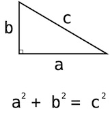

# [PCCE 기출문제] 2번 / 피타고라스의 정리
## 문제 설명
직각삼각형이 주어졌을 때 빗변의 제곱은 다른 두 변을 각각 제곱한 것의 합과 같습니다.



직각삼각형의 한 변의 길이를 나타내는 정수 `a`와 빗변의 길이를 나타내는 정수 `c`가 주어질 때, 다른 한 변의 길이의 제곱, `b_square` 을 출력하도록 한 줄을 수정해 코드를 완성해 주세요.

## 제한사항
- 1 ≤ `a` < `c` ≤ 100

## 입출력 예
### 입력 #1
```txt
3
5
```
### 출력 #1
```txt
16
```

### 입력 #2
```txt
9
10
```
### 출력 #2
```txt
19
```

## 입출력 예 설명
### 입출력 예 #1
- a2 = 9, c2 = 25 이므로 16을 출력합니다.

### 입출력 예 #2
- a2 = 81, c2 = 100 이므로 19를 출력합니다.

## solution.py
```python
a = int(input())
c = int(input())

b_square = c**2 - a**2      ## val**num : val의 num제곱
print(b_square)
```

## 해설
  1. **b_square = c**<sup>**2**</sup> **- a**<sup>**2**</sup>이므로, 제곱을 해주는 코드인 `**`을 활용한다. `**` 의 뒤에 2를 쓰면 **제곱**이고, 3을 쓰면 **세제곱**이다.
    - `pow(val, num)`을 이용하여 구할 수도 있다. `val`에 `밑수`, `num`에 `제곱수`를 넣는다.
     - 단순하게 `c * c - a * a`로 표현해도 된다.
